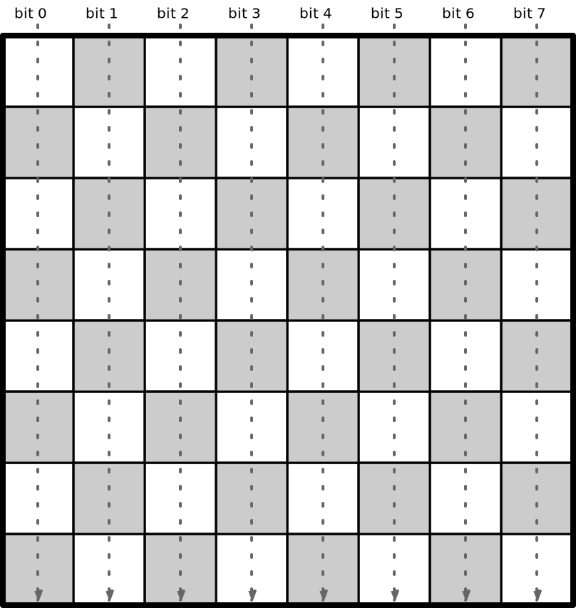
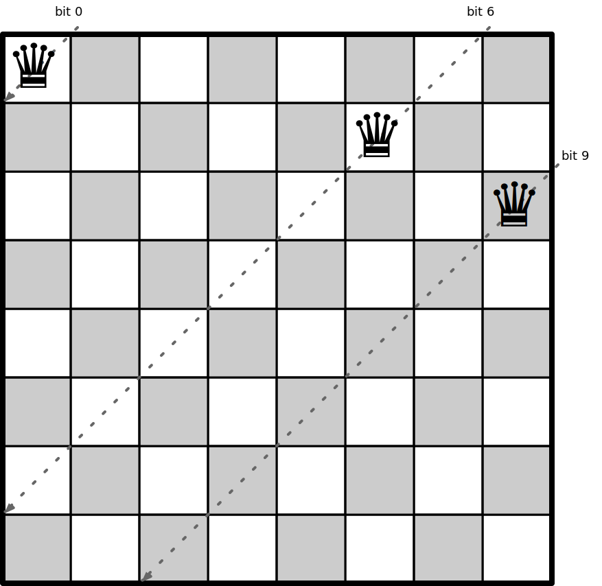
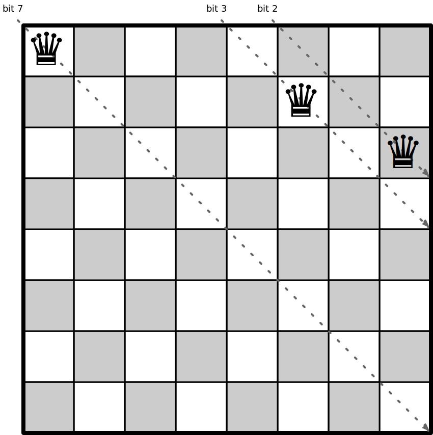

# N-Queens Problem

This project contains programs that count solutions to the [N Queens Problem](https://en.wikipedia.org/wiki/Eight_queens_puzzle).

We compare different programming languages and platforms, and also different program styles or techniques within those languages.

Unless otherwise noted, the same basic algorithm is used for all programs.

## Algorithm Description

We start with an empty board and count the solutions for boards found by placing a queen at each column on the first row.
For each of those boards, we count solutions recursively by placing queens on each available column on the next row.

At each stage, we have a board with queens placed up to a certain row. We proceed with these steps:

1. Find the available (unattacked) columns on the next row.
2. Find a new board for each of the available columns by placing a queen in the column.
3. Count the solutions for each of the new boards (recursively).
4. Return the sum of the counts.

To record the placement of queens, we keep track of these items:

1. The size of the board.
2. The current row.
3. The columns with queens in them.
4. The diagonals with queens in them.

We use bit sets to mark the columns and diagonals with queens in them.
Using a 64-bit integer as a representation of an immutable bit set,
and with these we can record up to 64 columns or diagonals.

We track the columns with queens in them using a bit set for the columns:



For example, with these three queens placed, bits 0, 5 and 7 are set,
giving an int value of 2<sup>0</sup> + 2<sup>5</sup> + 2<sup>7</sup>
= 1 + 32 + 128 = 161.


We track the diagonals with two bit sets. The first one has the diagonals to the left going down the board:


With the three queens placed, bits 0, 6 and 9 are set,
giving an int value of 2<sup>0</sup> + 2<sup>6</sup> + 2<sup>9</sup>
= 1 + 64 + 512 = 577.



The other diagonals go to the right going down the board:


With the three queens placed, bits 2, 3 and 7 are set,
giving an int value of 2<sup>2</sup> + 2<sup>3</sup> + 2<sup>7</sup>
= 4 + 8 + 128 = 140.



The available columns on the next row are those that are not currently attacked:


The number of solutions for the current position is the sum of the number of solutions for the boards found by placing queens on the available positions:


Using 64-bit integers for bit sets should let us count solutions for boards up to size 32.
The current world record for counting solutions is for [board size 27](https://github.com/preusser/q27), so this should suffice.

All of the programs use three functions:

* `ok(board, col)` returns true if the column is not currently attacked on the given board.
* `place(board, col)` returns a new board by adding a queen on the next row at the given column.
* `solve(board)` returns the number of solutions for the given board.

Pseudo-code for `ok()` is:

```
return cols bit at col is not set
  and diag1 bit at row+col is not set
  and diag2 bit at row-col+size-1 is not set
```

This function looks pretty much the same in any language, though the bitwise operators vary.

A typical example is in C:

```c
int ok(Board board, int col) {
  return (board.cols & (1 << col)) == 0 &&
        (board.diags1 & (1 << (board.row + col))) == 0 &&
        (board.diags2 & (1 << (board.row - col + board.size - 1))) == 0;
}
```

Not much different in Python:

```python
def is_ok(self, col):
    return (self.cols & (1 << col) == 0 and
            self.diags1 & (1 << self.row + col) == 0 and
            self.diags2 & (1 << self.row - col + self.size - 1) == 0)
```

Pseudo-code for `place()` is:

```
return new board of same size, with current row incremented by 1,
  cols with bit col set,
  diag1 with bit row+col set,
  diag2 with bit row-col+size-1 set
```

This function varies a bit more in different langauges, which vary in their data structures.

C uses plain old structs, which need to be populated with asignments:

```c
Board place(Board board, int col) {
  Board result;
  result.size = board.size;
  result.row = board.row + 1;
  result.cols = board.cols | 1 << col;
  result.diags1 = board.diags1 | 1 << (board.row + col);
  result.diags2 = board.diags2 | 1 << (board.row - col + board.size - 1);
  return result;
}
```

Object-oriented languages are similar, where structs are replaced with objects.

C# is typical:

```c#
private Board Place(int col) {
  Board result = new Board(this.size);
  result.row = this.row + 1;
  result.cols = this.cols | ((uint) 1) << col;
  result.diags1 = this.diags1 | ((uint) 1) << (this.row + col);
  result.diags2 = this.diags2 | ((uint) 1) << (this.row - col + this.size - 1);
  return result;
}
```

Functional languages use data types, such as in Haskell:

```haskell
place (Board {size = size, placed = row, cols = cols, diag1 = diag1, diag2 = diag2}) col =
  Board {
    size = size,
    placed = row + 1,
    cols = setBit cols col,
    diag1 = setBit diag1 (row + col),
    diag2 = setBit diag2 (row - col + size - 1)
  }
```

Pseudo-code for `solve()` is:

```
if row == size then return 1      # full board: count one solution
else
  return sum over col in 0..size-1 where ok(board, col) of:
    solve(place(board, col))
```

Imperative languages have to initialise a count and then loop, as in C++:

```c++
int Board::solve() {
  if (row_ == size_) {
    return 1;
  }
  else {
    int result = 0;
    for (int col = 0; col < size_; col++) {
      if (ok(col)) {
        result += place(col).solve();
      }
    }
    return result;
  }
}
```

Object-oriented languages can work like this, but often provide a more functional approach.

With Java's Streams API:

```java
public int solve() {
  return this.row == this.size ? 1 :
    range(0, this.size)
      .filter(this::ok)
      .mapToObj(this::place)
      .mapToInt(Board::solve)
      .sum();
}
```

Or C#'s LINQ feature:

```c#
public int Solve() {
  return this.row == this.size ? 1 :
    Enumerable.Range(1, this.size)
      .Where(col => Ok(col))
      .Select(col => Place(col).Solve())
      .Sum();
}
```

Perhaps the most elegant variation is F#'s data pipelines:

```f#
let rec solve board =
    if board.Row = board.Size then 1
        else seq { 0 .. board.Size - 1 }
            |> Seq.filter (ok board)
            |> Seq.map (place board)
            |> Seq.map solve
            |> Seq.sum
```

Or Elixir's:

```elixir
if board.row == board.size, do: 1, else: 1..board.size
  |> Enum.filter(fn col -> ok(board, col) end)
  |> Enum.map(fn col -> solve(place(board, col)) end)
  |> Enum.sum
```

## Algorithm Notes

For even sized boards, we can save half the work by using only half of the columns in the first row, and doubling the result.
For odd sized boards, we can do a similar trick counting twice for the first ((n-1)/2) columns, then once for the middle column.

This algorithm uses recursion and immutable data. This makes it well suited to parallelism.
However, the recursion means a call and a stack frame for every queen placed, which could be inefficient.
An algorithm using iteration instead of recursion might be more performant.
But it would also be harder to reason about and harder to make parallel.

