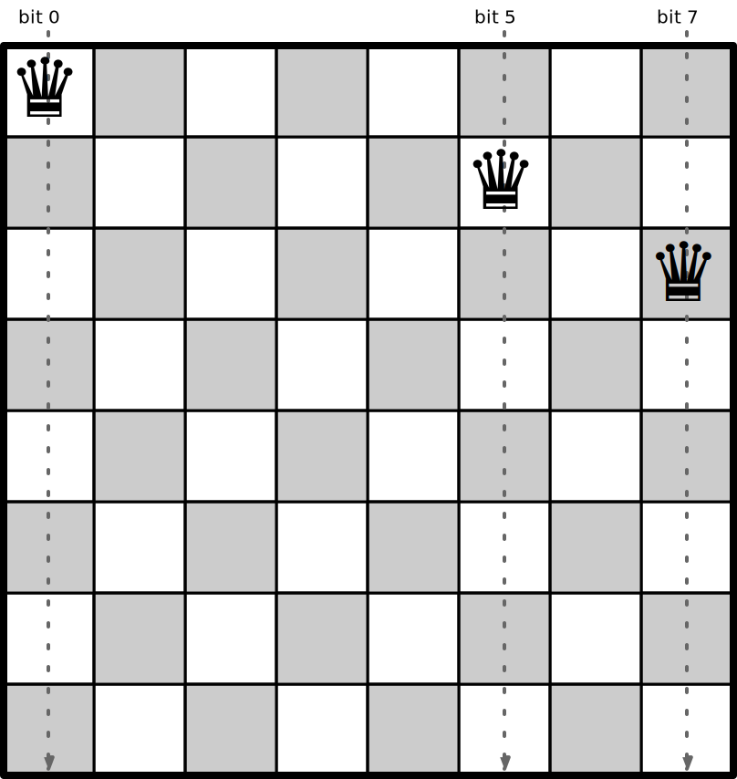

# N-Queens Problem

This project contains programs that count solutions to the [N Queens Problem](https://en.wikipedia.org/wiki/Eight_queens_puzzle).

We compare different programming languages and platforms, and also different program styles of techniques within those languages.

Unless otherwise noted, the same basic algorithm is used for all programs.

## Agorithm Description

We start with an empty board and count the solutions for boards found by placing a queen at each column on the first row.
For each of those boards, we find count solutions recursively by placing queens on each available column on the next row.

At each stage, we have a board with queens placed up to a certain row. We proceed with these steps:

1. Find the available (unattacked) columns on trhe next row.
2. Find a new board for each of the available columns by placing a queen in the column.
3. Count the solutions for each of the new boards.
4. Return the sum of the counts.

To record the placement of queens, we keep track of these items:

1. The current row.
2. The columns with queens in them.
3. The diagonals with queens in them.

We track the columns with queens in them using a bit string (long integer) for the columns:

For example, with these three queens placed, bits 0, 5 and 7 are set, giving a value of 1 + 32 + 128 = 161.

We track the diagonals with two bit strings. The first one has the diagonals to the left going down the board:

With the three queens placed, bits 0, 6 and 9 are set, giving a value of 1 + 64 + 512 = 577.

The other diagonals go to the right going down the board:

With the three queens placed, bits 2, 3 and 7 are set, giving a value of 4 + 8 + 128 = 140.

The available columns on the next row are those that are not currently attacked:

The number of solutions for the current position is the sum of the number of solutions for the boards found by placing queens on the available positions:

All of the programs use three functions:

* `ok(board, col)` returns true if the column is not currently attacked on the given board.
* `place(board, col)` returns a new board by adding a queen on the next row at the given column.
* `solve(board)` returns the number of solutions for the given board.

Pseudo-code for `ok()` is:

    return cols bit at col is not set
      and diag1 bit at row+col is not set
      and diag2 bit at row-col+size-1 is not set

Pseudo-code for `place()` is:

    return new board of same size, with current row incremented by 1,
      cols with bit col set,
      diag1 with bit row+col set,
      diag2 with bit row-col+size-1 set

Pseudo-code for `solve()` is:

    return sum over col in 0..size-1 where ok(board, col) of:
      solve(place(board, col))

